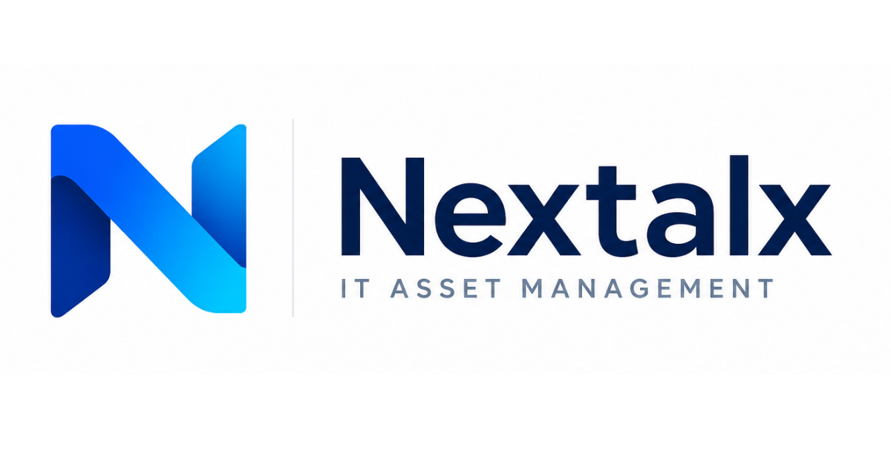
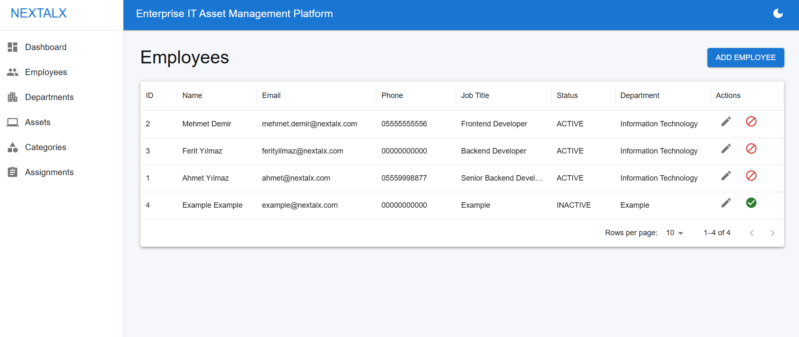
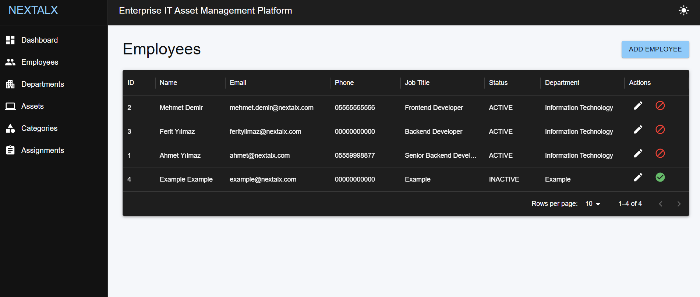
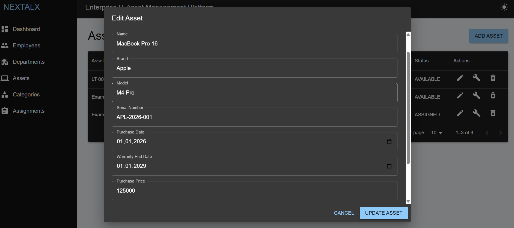
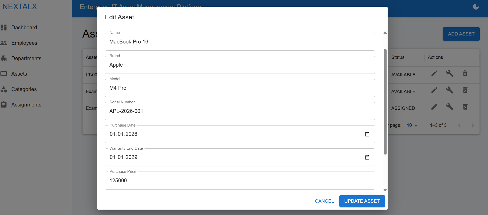
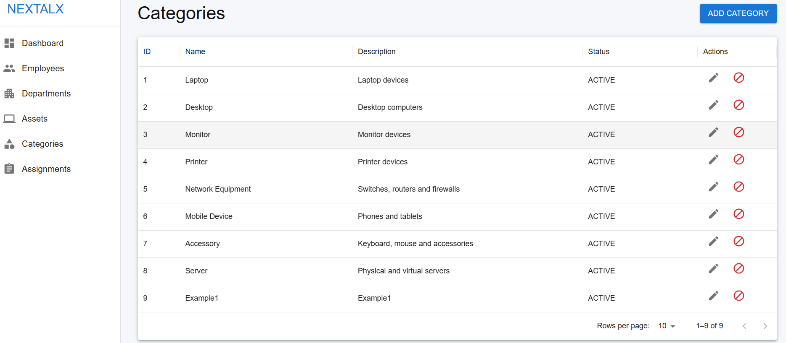
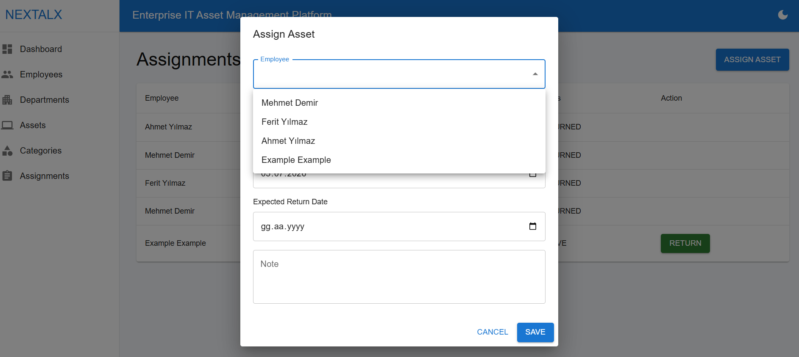

# 🔵 Nextalx

<div align="center">



### Enterprise IT Asset Management Platform

Modern, scalable and user-friendly IT Asset Management solution developed for enterprise environments.

Kurumsal ortamlar için geliştirilmiş modern, ölçeklenebilir ve kullanıcı dostu BT Varlık Yönetim Platformu.


</div>

---

# 🇬🇧 English

## 📌 About The Project

Nextalx is an enterprise-focused IT Asset Management platform designed to centralize and simplify hardware inventory operations.

The project eliminates spreadsheet-based asset tracking and provides a single source of truth for:

- Employees
- Departments
- Asset Categories
- IT Assets
- Asset Assignments

The goal of the project is to provide a clean, maintainable and extensible architecture that can evolve into a production-grade enterprise solution.

---

## ✨ Features

### 📊 Dashboard

- Total employee statistics
- Total asset statistics
- Assigned asset statistics
- Available asset statistics

### 🏢 Department Management

- Create departments
- Update departments
- Activate departments
- Deactivate departments

### 👨‍💼 Employee Management

- Create employees
- Update employees
- Activate employees
- Deactivate employees

### 📦 Category Management

- Create categories
- Update categories
- Activate categories
- Deactivate categories

### 💻 Asset Management

- Create assets
- Update assets
- Asset lifecycle management
- Status management:
    - AVAILABLE
    - ASSIGNED
    - IN_REPAIR
    - LOST
    - BROKEN
    - RETIRED

### 🔄 Assignment Management

- Assign assets to employees
- Return assets
- Automatic asset status updates
- Assignment history tracking infrastructure

---

## 🛠 Technology Stack

### Backend

- Java 25
- Spring Boot 3.5
- Hibernate
- PostgreSQL
- Flyway
- Maven

### Frontend

- React
- Vite
- Material UI
- Axios
- React Router

---

## 🏗 Architecture

### Backend Architecture

```text
Controller
    ↓
Service
    ↓
Repository
    ↓
Database
```

### Frontend Architecture

```text
Pages
    ↓
Components
    ↓
Services
    ↓
REST API
```

---

## 📁 Project Structure

```text
backend/
│
├── controller
├── dto
├── entity
├── enums
├── exception
├── mapper
├── repository
├── service
└── config

frontend/
│
├── components
├── dialogs
├── layouts
├── pages
├── routes
├── services
└── theme
```

---

## 🚀 Getting Started

### Backend

```bash
cd backend
./mvnw spring-boot:run
```

### Frontend

```bash
cd frontend
npm install
npm run dev
```

---

## 🌙 Features Included in v1.0.0

- Dark Mode support
- Material UI interface
- Dashboard analytics
- Asset lifecycle management

---

## 🗺 Roadmap

### v1.0.0
- [x] Dashboard
- [x] Departments
- [x] Employees
- [x] Categories
- [x] Assets
- [x] Assignments
- [x] Dark Mode

---

## 📷 Screenshots

 

 

 


---

## 👨‍💻 Author

### Melik Ulaş Erden

GitHub:

https://github.com/ulaserden

LinkedIn:

https://linkedin.com/in/melikulaserden

---

# 🇹🇷 Türkçe

## 📌 Proje Hakkında

Nextalx, kurumsal BT ekipleri için geliştirilmiş merkezi bir BT Varlık Yönetim platformudur.

Projenin amacı Excel tabloları ile yönetilen varlık süreçlerini merkezi hale getirerek aşağıdaki yapıların yönetimini kolaylaştırmaktır:

- Çalışanlar
- Departmanlar
- Varlık Kategorileri
- BT Varlıkları
- Varlık Atamaları

Proje sürdürülebilir, geliştirilebilir ve kurumsal ölçeklenebilirlik hedefleri gözetilerek tasarlanmıştır.

---

## ✨ Özellikler

### 📊 Dashboard

- Toplam çalışan sayısı
- Toplam varlık sayısı
- Atanmış varlık sayısı
- Kullanılabilir varlık sayısı

### 🏢 Departman Yönetimi

- Departman oluşturma
- Departman güncelleme
- Departman aktif/pasif yönetimi

### 👨‍💼 Çalışan Yönetimi

- Çalışan oluşturma
- Çalışan güncelleme
- Çalışan aktif/pasif yönetimi

### 📦 Kategori Yönetimi

- Kategori oluşturma
- Kategori güncelleme
- Kategori aktif/pasif yönetimi

### 💻 Varlık Yönetimi

- Varlık oluşturma
- Varlık güncelleme
- Varlık yaşam döngüsü yönetimi

Desteklenen durumlar:

- AVAILABLE
- ASSIGNED
- IN_REPAIR
- LOST
- BROKEN
- RETIRED

### 🔄 Atama Yönetimi

- Çalışanlara varlık atama
- Varlık geri alma
- Otomatik durum güncellemeleri

---

## 🛠 Kullanılan Teknolojiler

### Backend

- Java 25
- Spring Boot 3.5
- Hibernate
- PostgreSQL
- Flyway
- Maven

### Frontend

- React
- Vite
- Material UI
- Axios
- React Router

---

## 🚀 Kurulum

### Backend

```bash
cd backend
./mvnw spring-boot:run
```

### Frontend

```bash
cd frontend
npm install
npm run dev
```

---

## 🌙 v1.0.0 Özellikleri

- Dark Mode desteği
- Material UI arayüzü
- Dashboard analitiği
- Varlık yaşam döngüsü yönetimi

---

## 👨‍💻 Geliştirici

### Melik Ulaş Erden

GitHub:

https://github.com/ulaserden

LinkedIn:

https://linkedin.com/in/melikulaserden

---

<div align="center">

### ⭐ If you like this project, don't forget to star the repository.

### ⭐ Projeyi beğendiyseniz repoya yıldız vermeyi unutmayın.

</div>
