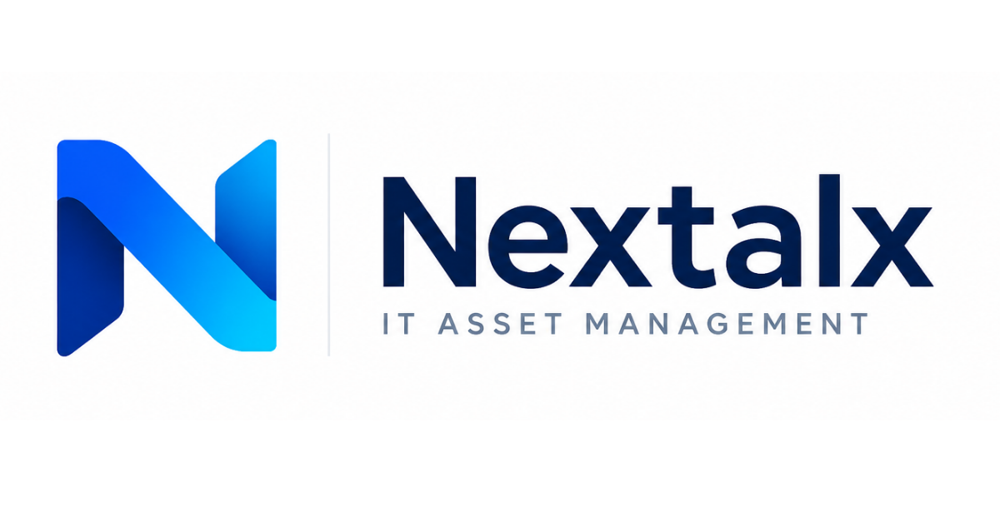
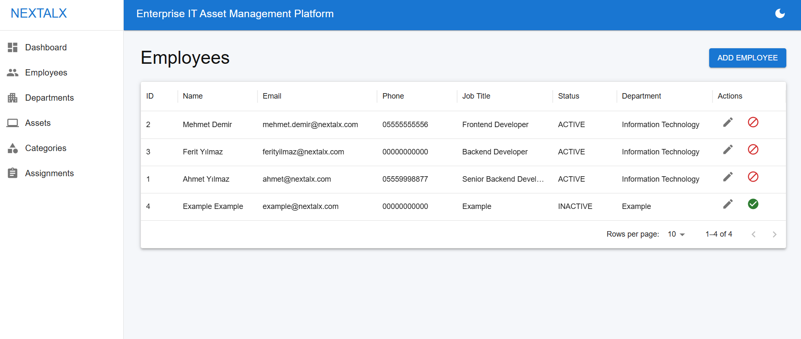
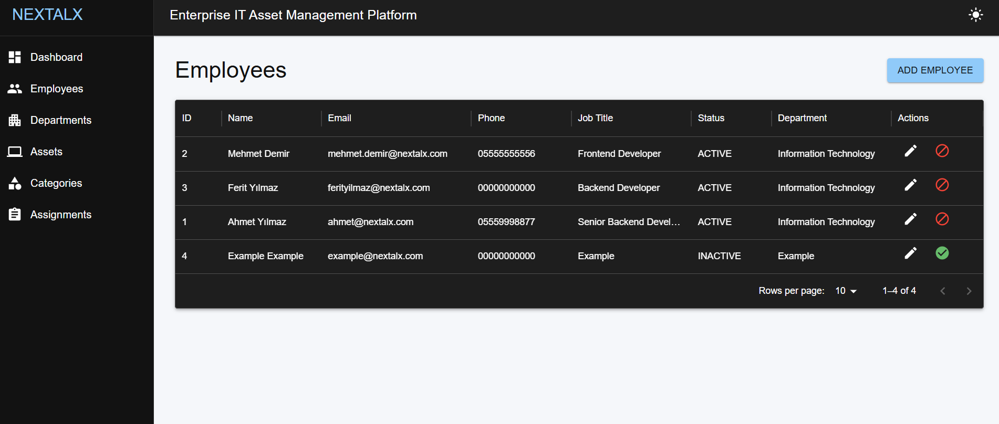
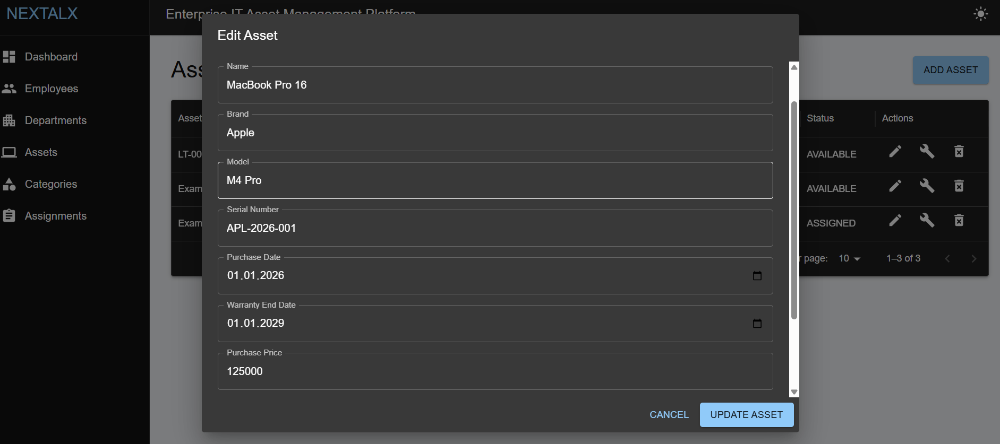
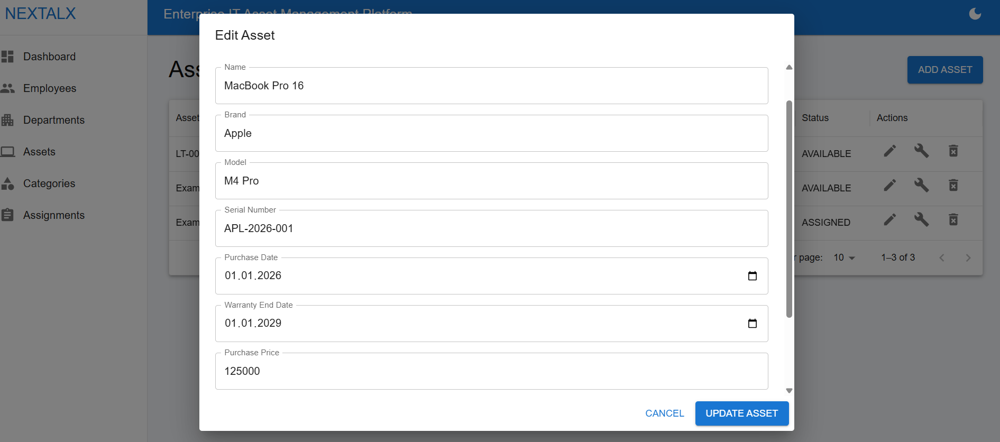
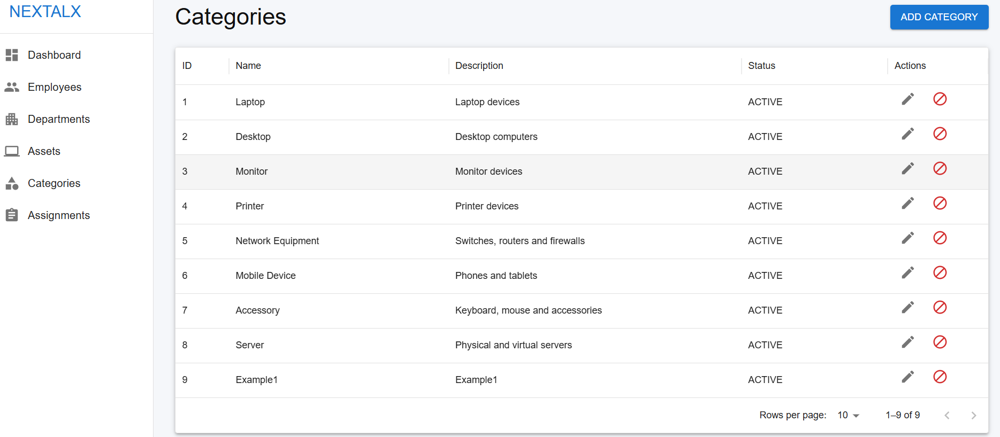
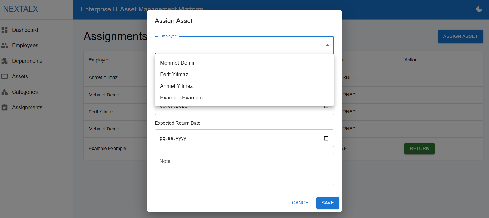

# 🔵 Nextalx

<div align="center">



### Enterprise IT Asset Management Platform

Modern, scalable and user-friendly IT Asset Management solution developed for enterprise environments.

Kurumsal ortamlar için geliştirilmiş modern, ölçeklenebilir ve kullanıcı dostu BT Varlık Yönetim Platformu.

[](https://github.com/ulaserden/nextalx/actions/workflows/ci.yml)


**🌐 Live Demo:** [nextalx.vercel.app](https://nextalx.vercel.app) · **📘 API Docs (Swagger):** [nextalx-api.onrender.com/swagger-ui.html](https://nextalx-api.onrender.com/swagger-ui.html)

</div>

> **Note:** The live demo runs on free tiers (Vercel + Render + Neon). The first request after an idle period may take a few seconds while the API and the database wake up. The demo has no authentication — please do not enter real data.

---

## 📑 Table of Contents

- [🇬🇧 English](#-english)
  - [About The Project](#-about-the-project)
  - [Features](#-features)
  - [Technology Stack](#-technology-stack)
  - [Architecture](#-architecture)
  - [Domain Model & Business Rules](#-domain-model--business-rules)
  - [REST API](#-rest-api)
  - [Project Structure](#-project-structure)
  - [Getting Started](#-getting-started)
  - [Configuration](#️-configuration)
  - [Testing & CI](#-testing--ci)
  - [Deployment](#️-deployment)
  - [Roadmap](#-roadmap)
  - [Screenshots](#-screenshots)
- [🇹🇷 Türkçe](#-türkçe)
- [👨‍💻 Author / Geliştirici](#-author--geliştirici)

---

# 🇬🇧 English

## 📌 About The Project

Nextalx is an enterprise-focused IT Asset Management platform designed to centralize and simplify hardware inventory operations.

The project eliminates spreadsheet-based asset tracking and provides a single source of truth for:

- Employees
- Departments
- Asset Categories
- IT Assets
- Asset Assignments (check-out / check-in)

The goal is a clean, maintainable and extensible architecture that can evolve into a production-grade enterprise solution. See [`docs/product-vision.md`](docs/product-vision.md) for the full product vision.

---

## ✨ Features

### 📊 Dashboard
- Total employees, total assets, assigned assets and available assets at a glance
- Fast, single-endpoint statistics (`GET /api/v1/dashboard/stats`)
- **Warranty alerts:** counts of expired and soon-to-expire warranties (next 90 days by default) with a list of the next expirations; each card opens the asset list pre-filtered

### 🏢 Department Management
- Create and update departments
- Activate / deactivate (records are never physically deleted)
- Unique department names enforced in code and at the database level

### 👨‍💼 Employee Management
- Create and update employees with department, job title, phone and e-mail
- Activate / deactivate employees; assignment history is preserved for inactive employees
- Unique e-mail enforced in code and at the database level

### 📦 Category Management
- Create and update hardware categories (Laptop, Monitor, Phone, Dock, …)
- Activate / deactivate categories

### 💻 Asset Management
- Register assets with asset tag, brand, model, serial number, purchase date, warranty end date, purchase price and supplier
- Full lifecycle management with explicit status transitions:
  `AVAILABLE` · `ASSIGNED` · `IN_REPAIR` · `RETIRED` · `LOST` · `BROKEN`
- Unique asset tag and serial number enforced by the database
- Status changes are blocked while an asset has an active assignment

### 🔄 Assignment Management
- Assign an available asset to an active employee
- Return an asset; the asset automatically becomes `AVAILABLE` again
- Only **one active assignment per asset**, guaranteed by a partial unique index
- Complete, never-deleted assignment history (audit trail)

### 🖥 User Experience
- Material UI interface with **dark mode** (persisted in `localStorage`)
- Fully **mobile-responsive** layout with collapsible sidebar
- Server-side pagination with MUI Data Grid
- Search and filtering on every list page (debounced search box, status and department / category filters; Turkish-aware, case-insensitive)
- Client-side form validation plus backend error messages surfaced via toast notifications
- Route-level code splitting and vendor chunking for fast first load
- Proper 404 page and active navigation highlighting

### 🛡 Platform & Operations
- Global exception handler returning a consistent `ApiErrorResponse` (400 / 404 / 409 / 500)
- Bean Validation on every request DTO
- Flyway-managed schema (V1–V8) with `ddl-auto: validate` — no Hibernate auto-DDL
- Optional API-key protection (`X-API-Key` header) that is disabled by default
- Configurable CORS origins
- Spring Boot Actuator health probes (`/actuator/health/liveness`, `/actuator/health/readiness`)
- OpenAPI 3 documentation with Swagger UI
- Production-ready multi-stage Dockerfile (non-root user, JVM tuned for 512 MB containers)
- GitHub Actions CI for backend (build + tests against PostgreSQL) and frontend (lint + build)

---

## 🛠 Technology Stack

### Backend

| Technology | Version | Purpose |
|------------|---------|---------|
| Java | 21 | Language |
| Spring Boot | 3.5.x | Application framework |
| Spring Web MVC | — | REST API |
| Spring Data JPA / Hibernate | — | Persistence |
| Spring Validation | — | Request validation |
| Spring Boot Actuator | — | Health & readiness probes |
| Flyway | — | Database migrations |
| PostgreSQL | 16+ | Relational database |
| springdoc-openapi | 2.8.x | OpenAPI 3 + Swagger UI |
| Lombok | — | Boilerplate reduction |
| Maven (wrapper) | 3.9 | Build |
| JUnit 5 + Mockito | — | Unit tests |

### Frontend

| Technology | Version | Purpose |
|------------|---------|---------|
| React | 19 | UI library |
| Vite | 8 | Build tool & dev server |
| Material UI | 9 | Component library & theming |
| MUI X Data Grid | 9 | Paginated data tables |
| React Router | 7 | Client-side routing |
| Axios | 1.x | HTTP client |
| react-hot-toast | 2.x | Notifications |
| ESLint | 10 | Linting |

### Infrastructure

| Piece | Platform |
|-------|----------|
| Frontend (SPA) | [Vercel](https://vercel.com) |
| Backend (Docker) | [Render](https://render.com) |
| Database | [Neon](https://neon.tech) serverless PostgreSQL |
| CI | GitHub Actions |

---

## 🏗 Architecture

```text
┌──────────────────────┐      HTTPS / JSON      ┌───────────────────────────┐      JDBC      ┌──────────────┐
│  React SPA (Vercel)  │ ─────────────────────▶ │ Spring Boot API (Render)  │ ─────────────▶ │  PostgreSQL  │
│  MUI · Router · Axios│ ◀───────────────────── │ /api/v1/**  ·  Swagger    │ ◀───────────── │   (Neon)     │
└──────────────────────┘                        └───────────────────────────┘                └──────────────┘
```

### Backend (layered)

```text
Controller  →  Service (interface + impl)  →  Repository (Spring Data JPA)  →  PostgreSQL
     │                 │
     │                 └── Mapper (Entity ⇄ DTO)
     └── GlobalExceptionHandler → ApiErrorResponse
```

- Controllers only handle HTTP concerns and delegate to services.
- Services own business rules (e.g. the assignment state machine).
- Entities extend a common `BaseEntity` (`id`, `createdAt`, `updatedAt`).
- All schema changes go through Flyway; Hibernate only validates.

### Frontend (feature-based)

```text
pages/  →  features/<domain>/ (tables + dialogs)  →  services/  →  api/axiosClient  →  REST API
   │
   └── layouts/MainLayout (Sidebar + Topbar) · context/ThemeContext (dark mode)
```

---

## 🧩 Domain Model & Business Rules

```text
Department (1) ──< Employee (N) ──< Assignment (N) >── Asset (N) >── Category (1)
```

| Entity | Key rules |
|--------|-----------|
| **Department** | Unique `name`; `ACTIVE` / `INACTIVE`; never deleted |
| **Employee** | Exactly one department; unique `email`; `ACTIVE` / `INACTIVE`; never deleted |
| **Category** | Unique `name`; `ACTIVE` / `INACTIVE`; never deleted |
| **Asset** | Unique `asset_tag` and `serial_number`; status ∈ `AVAILABLE, ASSIGNED, IN_REPAIR, RETIRED, LOST, BROKEN`; defaults to `AVAILABLE`; never deleted |
| **Assignment** | Only one active assignment per asset (`returned_date IS NULL`); assigning sets asset to `ASSIGNED`, returning sets it back to `AVAILABLE`; history is permanent |

Additional guarantees enforced by the database (`V6__add_indexes_and_constraints.sql`):

- `CHECK` constraints on asset and assignment statuses
- Partial unique index `uq_active_assignment_per_asset` on `assignments(asset_id) WHERE returned_date IS NULL`
- Indexes on every foreign key

Full details: [`docs/business-rules.md`](docs/business-rules.md), [`database/schema-v1.md`](database/schema-v1.md) and the ER diagram in [`database/diagrams`](database/diagrams).

---

## 🔌 REST API

Base URL: `/api/v1` · Interactive docs: `/swagger-ui.html` · OpenAPI JSON: `/v3/api-docs`

| Resource | Endpoints |
|----------|-----------|
| **Dashboard** | `GET /dashboard/stats` · `GET /dashboard/expiring-warranties?limit=5` |
| **Departments** | `GET /departments` · `POST /departments` · `PUT /departments/{id}` · `PATCH /departments/{id}/activate` · `PATCH /departments/{id}/deactivate` |
| **Employees** | `GET /employees` · `POST /employees` · `PUT /employees/{id}` · `PATCH /employees/{id}/activate` · `PATCH /employees/{id}/deactivate` |
| **Categories** | `GET /categories` · `POST /categories` · `PUT /categories/{id}` · `PATCH /categories/{id}/activate` · `PATCH /categories/{id}/deactivate` |
| **Assets** | `GET /assets` · `POST /assets` · `PUT /assets/{id}` · `PATCH /assets/{id}/available` · `PATCH /assets/{id}/repair` · `PATCH /assets/{id}/retire` · `PATCH /assets/{id}/lost` · `PATCH /assets/{id}/broken` |
| **Assignments** | `GET /assignments` · `POST /assignments` · `PUT /assignments/{id}/return` |
| **Health** | `GET /actuator/health` · `GET /actuator/health/liveness` · `GET /actuator/health/readiness` |

- List endpoints are paginated: `?page=0&size=10` (Spring `Page<T>` response).
- List endpoints accept optional filters; `search` is a case-insensitive "contains" match:

  | Endpoint | `search` matches | Other filters |
  |----------|------------------|---------------|
  | `GET /assets` | tag, name, brand, model, serial number, supplier | `status`, `categoryId`, `warranty` (`EXPIRING` / `EXPIRED` / `VALID`) |
  | `GET /employees` | full name, e-mail, phone, job title | `status`, `departmentId` |
  | `GET /departments`, `GET /categories` | name, description | `status` |
  | `GET /assignments` | employee name / e-mail, asset tag / name / serial | `status`, `employeeId`, `assetId` |

  Example: `GET /api/v1/assets?search=thinkpad&status=AVAILABLE&page=0&size=10`
- Asset responses include `warrantyStatus` (`VALID` / `EXPIRING` / `EXPIRED`) and `warrantyDaysRemaining` (negative once expired). Both are `null` for assets without a warranty end date or out of service (`RETIRED`, `LOST`).
- `POST` returns `201 Created`; validation errors return `400`; missing resources `404`; conflicts (duplicates, invalid state transitions) `409`.
- Error body:

```json
{
  "status": 409,
  "message": "Asset is already assigned.",
  "timestamp": "2026-09-09T10:15:30"
}
```

- There are intentionally **no `DELETE` endpoints**; removal is modelled as deactivation or a lifecycle status.
- Ready-to-run request collections live in [`backend/nextalx-api/http`](backend/nextalx-api/http) (IntelliJ HTTP Client format).

---

## 📁 Project Structure

```text
nextalx/
├── .github/workflows/
│   ├── ci.yml                 # Backend build+test (PostgreSQL service) · Frontend lint+build
│   └── keep-alive.yml         # Backup pinger for the free-tier API
├── backend/nextalx-api/
│   ├── Dockerfile             # Multi-stage build → slim JRE 21, non-root
│   ├── http/                  # HTTP client request collections
│   ├── pom.xml
│   └── src/
│       ├── main/java/com/nextalx/
│       │   ├── config/        # CORS, OpenAPI
│       │   ├── controller/    # REST controllers
│       │   ├── dto/           # request / response DTOs
│       │   ├── entity/        # JPA entities (BaseEntity, Department, Employee, Category, Asset, Assignment)
│       │   ├── enums/         # AssetStatus, AssignmentStatus
│       │   ├── exception/     # Domain exceptions + GlobalExceptionHandler
│       │   ├── mapper/        # Entity ⇄ DTO mappers
│       │   ├── repository/    # Spring Data JPA repositories
│       │   ├── security/      # Optional ApiKeyFilter
│       │   └── service/       # Service interfaces + impl/
│       ├── main/resources/
│       │   ├── application.yaml
│       │   └── db/migration/  # Flyway V1 … V8
│       └── test/java/         # Unit tests (assignment state machine)
├── frontend/
│   ├── src/
│   │   ├── api/               # axiosClient (base URL + error normalisation)
│   │   ├── components/        # layout, dashboard, assignments
│   │   ├── context/           # ThemeContext (dark mode + toaster)
│   │   ├── features/          # assets, categories, departments, employees (tables + dialogs)
│   │   ├── layouts/           # MainLayout
│   │   ├── pages/             # Route pages (lazy-loaded)
│   │   ├── routes/            # AppRoutes
│   │   ├── services/          # API service modules
│   │   └── theme.js           # MUI theme (light / dark)
│   ├── vercel.json            # SPA rewrite
│   └── vite.config.js         # Manual vendor chunking
├── database/                  # DBML schema, ER diagram, schema docs
├── docs/                      # Product vision, business rules, images
├── screenshots/
├── DEPLOYMENT.md              # Step-by-step Vercel + Render + Neon guide
├── DOCKER_ROADMAP.md
└── render.yaml                # Render Blueprint
```

---

## 🚀 Getting Started

### Prerequisites

- Java 21 (JDK)
- Node.js 20+
- PostgreSQL 16+ (a local instance or Docker)

### 1. Database

```bash
# Example with Docker
docker run --name nextalx-db -e POSTGRES_DB=nextalx -e POSTGRES_USER=postgres -e POSTGRES_PASSWORD=postgre -p 5432:5432 -d postgres:16
```

Flyway creates the schema automatically on first start and seeds demo data (5 departments, 16 employees, 7 categories, 28 assets, 19 assignments).

### 2. Backend

```bash
cd backend/nextalx-api
./mvnw spring-boot:run        # Windows: mvnw.cmd spring-boot:run
```

- API: http://localhost:8080/api/v1
- Swagger UI: http://localhost:8080/swagger-ui.html
- Health: http://localhost:8080/actuator/health

### 3. Frontend

```bash
cd frontend
cp .env.example .env          # optional – defaults to http://localhost:8080/api/v1
npm install
npm run dev
```

Open http://localhost:5173.

### Run with Docker (backend only)

```bash
cd backend/nextalx-api
docker build -t nextalx-api .
docker run -p 8080:8080 \
  -e SPRING_DATASOURCE_URL=jdbc:postgresql://host.docker.internal:5432/nextalx \
  -e SPRING_DATASOURCE_USERNAME=postgres \
  -e SPRING_DATASOURCE_PASSWORD=postgre \
  nextalx-api
```

---

## ⚙️ Configuration

### Backend environment variables

| Variable | Default | Description |
|----------|---------|-------------|
| `SPRING_DATASOURCE_URL` | `jdbc:postgresql://localhost:5432/nextalx` | JDBC URL |
| `SPRING_DATASOURCE_USERNAME` | `postgres` | DB user |
| `SPRING_DATASOURCE_PASSWORD` | `postgre` | DB password (local only, never reuse) |
| `PORT` | `8080` | HTTP port |
| `APP_CORS_ALLOWED_ORIGINS` | `http://localhost:5173,5174,5175` | Comma-separated allowed origins |
| `API_KEY` | *(empty = disabled)* | When set, `/api/v1/**` requires `X-API-Key` |
| `WARRANTY_EXPIRING_WITHIN_DAYS` | `90` | Warranties ending within this many days count as "expiring" |
| `DB_POOL_SIZE` | `5` | Hikari max pool size |
| `DB_POOL_MIN_IDLE` | `0` | Hikari min idle (0 lets serverless DBs suspend) |
| `JPA_SHOW_SQL` | `false` | Log SQL |
| `JAVA_OPTS` | `-XX:MaxRAMPercentage=65.0 -XX:+UseSerialGC -Xss512k` | JVM flags (Docker) |

### Frontend environment variables

| Variable | Default | Description |
|----------|---------|-------------|
| `VITE_API_URL` | `http://localhost:8080/api/v1` | Backend base URL (**build-time**, rebuild after changing) |

---

## 🧪 Testing & CI

```bash
# Backend – unit tests + context test (needs a reachable PostgreSQL)
cd backend/nextalx-api && ./mvnw verify

# Frontend – lint + production build
cd frontend && npm run lint && npm run build
```

The assignment state machine is covered by unit tests (`AssignmentServiceImplTest`): assigning available assets, rejecting assets that are unavailable or already assigned, rejecting inactive employees, and preventing double returns.

GitHub Actions ([`ci.yml`](.github/workflows/ci.yml)) runs both jobs on every push and pull request to `main`, spinning up a PostgreSQL 16 service container for the backend.

---

## ☁️ Deployment

The production setup is fully documented in [`DEPLOYMENT.md`](DEPLOYMENT.md):

- **Neon** – serverless PostgreSQL (connection pooling off for Flyway, pool drains to zero so compute can suspend)
- **Render** – Docker web service created from [`render.yaml`](render.yaml), health-checked on `/actuator/health/liveness`
- **Vercel** – Vite SPA with `VITE_API_URL` injected at build time
- **Keep-alive** – external cron pinger plus a backup [GitHub Actions workflow](.github/workflows/keep-alive.yml) so the free-tier API stays warm

---

## 🗺 Roadmap

### v1.0.0 ✅
- [x] Dashboard statistics
- [x] Departments, Employees, Categories, Assets, Assignments (CRUD + lifecycle)
- [x] Dark mode & responsive UI
- [x] OpenAPI / Swagger documentation
- [x] Flyway migrations & DB-level integrity constraints
- [x] Docker image, CI pipeline, cloud deployment

### Next
- [ ] Authentication & role-based access control (JWT / Spring Security)
- [ ] Global search and filtering on list pages
- [ ] Reports & exports (CSV / PDF)
- [ ] Maintenance & repair history
- [ ] Software license management
- [ ] Notifications (warranty expiry, overdue returns)
- [ ] QR / barcode scanning
- [ ] `docker-compose` for full local stack (see [`DOCKER_ROADMAP.md`](DOCKER_ROADMAP.md))

---

## 📷 Screenshots

 

 

 

---

# 🇹🇷 Türkçe

## 📌 Proje Hakkında

Nextalx, kurumsal BT ekipleri için geliştirilmiş merkezi bir BT Varlık Yönetim (IT Asset Management) platformudur.

Amacı, Excel tabloları ile yürütülen varlık süreçlerini tek bir güvenilir kaynakta toplayarak aşağıdaki yapıların yönetimini kolaylaştırmaktır:

- Çalışanlar
- Departmanlar
- Varlık Kategorileri
- BT Varlıkları
- Varlık Atamaları / Zimmet (teslim etme – geri alma)

Proje; sürdürülebilir, geliştirilebilir ve kurumsal ölçeklenebilirlik hedefleri gözetilerek katmanlı bir mimariyle tasarlanmıştır. Ürün vizyonu için [`docs/product-vision.md`](docs/product-vision.md) dosyasına bakabilirsiniz.

**🌐 Canlı Demo:** [nextalx.vercel.app](https://nextalx.vercel.app) · **📘 API Dokümantasyonu:** [Swagger UI](https://nextalx-api.onrender.com/swagger-ui.html)

> Canlı demo ücretsiz planlarda (Vercel + Render + Neon) çalışır. Uzun süre istek gelmediğinde ilk açılış birkaç saniye sürebilir. Demo ortamında kimlik doğrulama yoktur; gerçek veri girmeyiniz.

---

## ✨ Özellikler

### 📊 Dashboard
- Toplam çalışan, toplam varlık, atanmış varlık ve kullanılabilir varlık sayıları
- Tek istekle istatistikler (`GET /api/v1/dashboard/stats`)
- **Garanti uyarıları:** süresi dolmuş ve yakında dolacak (varsayılan 90 gün) garanti sayıları ile en yakın bitişlerin listesi; kartlar filtrelenmiş varlık listesini açar

### 🏢 Departman Yönetimi
- Departman oluşturma ve güncelleme
- Aktif / pasif yönetimi (kayıtlar fiziksel olarak silinmez)
- Benzersiz departman adı hem kodda hem veritabanında zorunlu

### 👨‍💼 Çalışan Yönetimi
- Departman, unvan, telefon ve e-posta bilgileriyle çalışan oluşturma ve güncelleme
- Aktif / pasif yönetimi; pasif çalışanların zimmet geçmişi korunur
- Benzersiz e-posta hem kodda hem veritabanında zorunlu

### 📦 Kategori Yönetimi
- Donanım kategorileri (Laptop, Monitör, Telefon, Dock, …) oluşturma ve güncelleme
- Aktif / pasif yönetimi

### 💻 Varlık Yönetimi
- Varlık etiketi, marka, model, seri numarası, satın alma tarihi, garanti bitiş tarihi, fiyat ve tedarikçi bilgileriyle kayıt
- Açık durum geçişleriyle tam yaşam döngüsü yönetimi:
  `AVAILABLE` · `ASSIGNED` · `IN_REPAIR` · `RETIRED` · `LOST` · `BROKEN`
- Benzersiz varlık etiketi ve seri numarası veritabanı seviyesinde garanti altında
- Aktif zimmeti olan varlığın durumu elle değiştirilemez

### 🔄 Atama (Zimmet) Yönetimi
- Kullanılabilir bir varlığı aktif bir çalışana atama
- Varlığı geri alma; varlık otomatik olarak yeniden `AVAILABLE` olur
- **Bir varlık için aynı anda yalnızca bir aktif zimmet** (kısmi unique index ile garanti)
- Hiç silinmeyen, eksiksiz zimmet geçmişi (denetim izi)

### 🖥 Kullanıcı Deneyimi
- Material UI arayüzü ve **karanlık mod** (tercih `localStorage`'da saklanır)
- Daraltılabilir kenar çubuğu ile tamamen **mobil uyumlu** tasarım
- MUI Data Grid ile sunucu taraflı sayfalama
- Tüm liste sayfalarında arama ve filtreleme (gecikmeli arama kutusu, durum ve departman / kategori filtreleri; büyük-küçük harf duyarsız, Türkçe karakter uyumlu)
- İstemci tarafı form doğrulama ve backend hata mesajlarının toast bildirimi olarak gösterimi
- Rota bazlı code splitting ve vendor chunk ayrımı ile hızlı ilk açılış
- 404 sayfası ve aktif menü vurgusu

### 🛡 Platform ve Operasyon
- Tutarlı `ApiErrorResponse` döndüren global hata yakalayıcı (400 / 404 / 409 / 500)
- Tüm istek DTO'larında Bean Validation
- Flyway ile yönetilen şema (V1–V8), `ddl-auto: validate` — Hibernate auto-DDL yok
- Varsayılan olarak kapalı, isteğe bağlı API anahtarı koruması (`X-API-Key`)
- Yapılandırılabilir CORS
- Spring Boot Actuator liveness / readiness probe'ları
- OpenAPI 3 + Swagger UI
- Üretime hazır çok aşamalı Dockerfile (root olmayan kullanıcı, 512 MB için ayarlanmış JVM)
- Backend (PostgreSQL ile build + test) ve frontend (lint + build) için GitHub Actions CI

---

## 🛠 Kullanılan Teknolojiler

**Backend:** Java 21 · Spring Boot 3.5 · Spring Web MVC · Spring Data JPA / Hibernate · Spring Validation · Actuator · Flyway · PostgreSQL 16+ · springdoc-openapi (Swagger) · Lombok · Maven · JUnit 5 / Mockito

**Frontend:** React 19 · Vite 8 · Material UI 9 · MUI X Data Grid · React Router 7 · Axios · react-hot-toast · ESLint

**Altyapı:** Vercel (frontend) · Render (Docker backend) · Neon (serverless PostgreSQL) · GitHub Actions (CI)

---

## 🏗 Mimari

```text
React SPA (Vercel)  ──HTTPS/JSON──▶  Spring Boot API (Render)  ──JDBC──▶  PostgreSQL (Neon)
```

**Backend (katmanlı):** `Controller → Service (arayüz + impl) → Repository → PostgreSQL`, Entity ⇄ DTO dönüşümü için `Mapper`, tüm hatalar için `GlobalExceptionHandler`. Tüm entity'ler ortak `BaseEntity` (`id`, `createdAt`, `updatedAt`) sınıfından türer.

**Frontend (feature bazlı):** `pages → features/<alan> (tablo + dialog) → services → api/axiosClient → REST API`. Ortak `MainLayout` (Sidebar + Topbar) ve `ThemeContext` (karanlık mod).

Alan modeli:

```text
Department (1) ──< Employee (N) ──< Assignment (N) >── Asset (N) >── Category (1)
```

İş kuralları için [`docs/business-rules.md`](docs/business-rules.md), şema için [`database/schema-v1.md`](database/schema-v1.md) dosyalarına bakınız.

---

## 🔌 REST API

Temel adres: `/api/v1` · Swagger UI: `/swagger-ui.html`

| Kaynak | Uç noktalar |
|--------|-------------|
| **Dashboard** | `GET /dashboard/stats` · `GET /dashboard/expiring-warranties?limit=5` |
| **Departmanlar** | `GET` · `POST` · `PUT /{id}` · `PATCH /{id}/activate` · `PATCH /{id}/deactivate` |
| **Çalışanlar** | `GET` · `POST` · `PUT /{id}` · `PATCH /{id}/activate` · `PATCH /{id}/deactivate` |
| **Kategoriler** | `GET` · `POST` · `PUT /{id}` · `PATCH /{id}/activate` · `PATCH /{id}/deactivate` |
| **Varlıklar** | `GET` · `POST` · `PUT /{id}` · `PATCH /{id}/available` · `/repair` · `/retire` · `/lost` · `/broken` |
| **Atamalar** | `GET` · `POST` · `PUT /{id}/return` |

- Liste uç noktaları isteğe bağlı `search` (içerir araması) ve filtre parametreleri alır: `status`, `categoryId` (varlıklar), `departmentId` (çalışanlar), `warranty` (varlıklar: `EXPIRING` / `EXPIRED` / `VALID`), `employeeId` / `assetId` (zimmetler). Örnek: `GET /api/v1/assets?search=thinkpad&status=AVAILABLE`
- Liste uç noktaları sayfalıdır: `?page=0&size=10`
- `POST` → `201 Created`; doğrulama hatası → `400`; bulunamadı → `404`; çakışma / geçersiz durum geçişi → `409`
- Bilinçli olarak **`DELETE` uç noktası yoktur**; silme yerine pasifleştirme veya yaşam döngüsü durumu kullanılır.
- Hazır istek koleksiyonları: [`backend/nextalx-api/http`](backend/nextalx-api/http)

---

## 🚀 Kurulum

### Gereksinimler

- Java 21 (JDK)
- Node.js 20+
- PostgreSQL 16+ (yerel kurulum veya Docker)

### 1. Veritabanı

```bash
docker run --name nextalx-db -e POSTGRES_DB=nextalx -e POSTGRES_USER=postgres -e POSTGRES_PASSWORD=postgre -p 5432:5432 -d postgres:16
```

Şema ilk çalıştırmada Flyway tarafından otomatik oluşturulur ve demo verisi (5 departman, 16 çalışan, 7 kategori, 28 varlık, 19 zimmet) yüklenir.

### 2. Backend

```bash
cd backend/nextalx-api
./mvnw spring-boot:run        # Windows: mvnw.cmd spring-boot:run
```

- API: http://localhost:8080/api/v1
- Swagger UI: http://localhost:8080/swagger-ui.html

### 3. Frontend

```bash
cd frontend
cp .env.example .env          # isteğe bağlı – varsayılan http://localhost:8080/api/v1
npm install
npm run dev
```

Tarayıcıda http://localhost:5173 adresini açın.

### Ortam Değişkenleri

| Değişken | Varsayılan | Açıklama |
|----------|------------|----------|
| `SPRING_DATASOURCE_URL` | `jdbc:postgresql://localhost:5432/nextalx` | JDBC adresi |
| `SPRING_DATASOURCE_USERNAME` | `postgres` | Veritabanı kullanıcısı |
| `SPRING_DATASOURCE_PASSWORD` | `postgre` | Veritabanı şifresi (sadece yerel) |
| `APP_CORS_ALLOWED_ORIGINS` | `http://localhost:5173,…` | İzin verilen origin'ler (virgülle) |
| `API_KEY` | *(boş = kapalı)* | Ayarlanırsa `/api/v1/**` için `X-API-Key` zorunlu |
| `WARRANTY_EXPIRING_WITHIN_DAYS` | `90` | Bu kadar gün içinde biten garantiler "yakında dolacak" sayılır |
| `VITE_API_URL` (frontend) | `http://localhost:8080/api/v1` | Backend adresi (**build zamanı**) |

---

## 🧪 Test ve CI

```bash
cd backend/nextalx-api && ./mvnw verify      # backend testleri (PostgreSQL gerekir)
cd frontend && npm run lint && npm run build  # frontend lint + build
```

Zimmet durum makinesi `AssignmentServiceImplTest` ile birim testlerine sahiptir. GitHub Actions, `main` dalına yapılan her push ve pull request'te backend ve frontend işlerini çalıştırır.

---

## ☁️ Dağıtım (Deployment)

Üretim kurulumu adım adım [`DEPLOYMENT.md`](DEPLOYMENT.md) dosyasında anlatılmıştır: Neon (veritabanı), Render (`render.yaml` Blueprint ile Docker servisi) ve Vercel (SPA). Ücretsiz plandaki API'nin uykuya geçmemesi için harici cron pinger ve yedek olarak GitHub Actions keep-alive workflow'u kullanılır.

---

## 🗺 Yol Haritası

- [x] **v1.0.0** — Dashboard, Departmanlar, Çalışanlar, Kategoriler, Varlıklar, Zimmetler, karanlık mod, Swagger, Flyway, Docker, CI, bulut dağıtımı
- [ ] Kimlik doğrulama ve rol bazlı yetkilendirme (JWT / Spring Security)
- [ ] Global arama ve filtreleme
- [ ] Raporlar ve dışa aktarma (CSV / PDF)
- [ ] Bakım / onarım geçmişi
- [ ] Yazılım lisans yönetimi
- [ ] Bildirimler (garanti bitişi, geciken iadeler)
- [ ] QR / barkod okuma
- [ ] Tam yerel ortam için `docker-compose` ([`DOCKER_ROADMAP.md`](DOCKER_ROADMAP.md))

---

## 👨‍💻 Author / Geliştirici

### Melik Ulaş Erden

- GitHub: [github.com/ulaserden](https://github.com/ulaserden)
- LinkedIn: [linkedin.com/in/melikulaserden](https://linkedin.com/in/melikulaserden)

---

## 📄 License / Lisans

This project is licensed under the **MIT License**.

Bu proje **MIT Lisansı** ile lisanslanmıştır.

---

<div align="center">

### ⭐ If you like this project, don't forget to star the repository.

### ⭐ Projeyi beğendiyseniz repoya yıldız vermeyi unutmayın.

</div>
